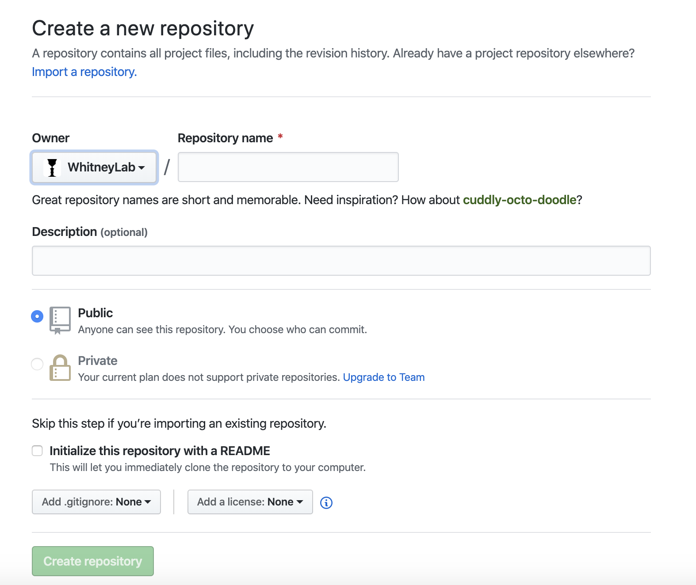

# Tutorials
Lab repository tutorials

Hi! Welcome to the Whitney Lab! This is a simple introduction for both mentors and RAs to manage your project source codes.

## For Mentors

### Create new team
* Click the green `New team` button inside the **Teams** tab

* Set up your **team name** and a **brief description** about your team. The new team can be a child team of your previous team and you can select its parent team from the menu. At last, you can decide whether to put the team **Visible** or **Secret**(Private) from the whole organization.

* After the setups, you may find your team under the Team list.


### Manage teams
* Click the team name, you can enter the team Dashboard where you can manage the team.

    - From the left column area, you can **Edit** your team description, **Add** more members, and change your **Notification** preference.
    - From the top row, you can switch to different attributes of the team by clicking the corresponding tabs.
        - **Members** : You can also add team members here。
        - **Teams** : The place where you can **create child teams**.
        - **Repositories** : You can add repositories from the organization repositories. Remember to change the **Permission Level** for every repository you added so that the team members counld have certain permisison on the repos.
        - **Settings** : This is the place where you can modify the **team profiles** (Name, description, team visibility, profile picture, etc.). It is the only place where you can **delete** the team.

### Create new repository
* Go back to the origanization dashboard. You can find the green `New` button.

* Click on it, you will see the new repository setting page. Similarly, you can set your **repository name** and write a **brief intro** to your repo. You can also decide whether to share this repo with other lab members inside this organization by choosing **Public** or **Private**. At last, I recommend you that *Initialize this repository with a README*, where you can write instructions about your repository. (*README file* is based on Markdown syntax, you can find the basic syntax [here](https://help.github.com/en/github/writing-on-github/basic-writing-and-formatting-syntax). For writing the fomulas, most *Latex* syntax works and you can check [here](https://en.wikibooks.org/wiki/LaTeX/Mathematics).)

* Your repository should be built right now. Then you can check the link which allows you to clone this repository on your local computer. Click the green `Clone or download` button, you can copy the link.


#### - Push a new repository from scratch
* Open a terminal, go to your target folder, and run the command
```
git clone Your_repo_link
```
Then you can see the repo folder cloned to your folder. And you can add your source code in this folder.
* When everything is ready, run the following commands.
```
git add .
git commit -m "Your commit comment"
git push
```
You can select the files to `push` by changing `git add .` into `git add FILENAME`.
* Refresh the repo page, you may see your updates.

#### - Push an existing repository to the organization
If you already have a repository and want to push to the organization, you need to add additional push URLs to your git config file.
* Go to your repository folder, type `ls -al`, and you will see *.git* inside this folder.
* Do `vim .git/config`, then you will see
```
[core]
        repositoryformatversion = 0
        filemode = true
        bare = false
        logallrefupdates = true
        ignorecase = true
        precomposeunicode = true
[remote "origin"]
        url = Your_original_git_repo_link
        fetch = +refs/heads/*:refs/remotes/origin/*
[branch "master"]
        remote = origin
        merge = refs/heads/master
```
* Add your addition push URLs under `[remote "origin"]` like
(For editting, enter `i` to enter the insert mode, go to the line using arrows and start editting. When you finish, press `esc` to exit the insert mode and type `:wq` to save and exit. For mac touchbar users, you may want to remap keyboard to have the `esc` key.)
```
[remote "origin"]
        url = Your_original_git_repo_link
        fetch = +refs/heads/*:refs/remotes/origin/*
        pushurl = Your_original_git_repo_link
        pushurl = Your_new_git_repo_link
```
Then every time you commit and push changes, Github will automatically update the repos which you listed using `pushurl`.
(For editting using **Vim**, check [here](https://www.tutorialspoint.com/vim/vim_quick_guide.htm))

### Code Review
While someone submit a **pull request**, it will automatically create a discussion forum where you can comment and reply to the changes. When everything is done, you can merge the changes into your **master branch** by clicking `Merge pull request`.

When a **merge conflict** happen, you can resolve it by checking the conflict codes and deciding which change to make. For details, check [here](https://help.github.com/en/github/collaborating-with-issues-and-pull-requests/resolving-a-merge-conflict-on-github)

## For RAs
Based on the permission to certain repositories, you can read/write/manage the repositories. When you have the latter two permissions, you can make changes to the source code.

To make changes,
* Clone the repository.
```
git clone Your_repo_link
```
You can find the link while entering the repository page and clicking the green `Clone or download` button.
* Make changes to the source code.
* The second time you make the changes, make sure run the command `git pull` to fetch the latest updates on the master brach.

### Commit codes
When you have your changes ready, remember to **create a new branch** and **submit a pull request**, rather than push the changes to the master branch directly which is **dangerous**. You can run the following commands to do so.
```
git checkout -b Your_new_branch_name
git add .
git commit -m "Your commit comment"
git push origin Your_new_branch_name
```
Then the repository owner can see a pull request and review your changes.

* When you collaberate with others, remember that do not make the changes at the same time. It will bring in merge conflicts while submitting the pull request. Every time, make sure that your changes are based on the latest commit.

## Basics
* **Discussions** : Team members can discuss issues here. You can start a new discussion or reply to others discussion.

### Git operations
Check the git [cheat sheet](https://github.github.com/training-kit/downloads/github-git-cheat-sheet.pdf).
